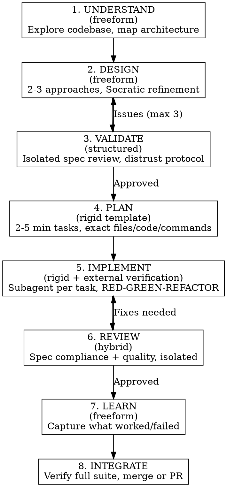

# Architecture Plugin Patterns v2

Guidance for plugins handling software architecture design and implementation. Read when building plugins for system design, ADRs, plan→implement→review pipelines, or multi-phase development workflows.

---

## Why architecture plugins fail differently

Architecture plugins face a unique problem: the design phase requires **freeform reasoning** (exploring tradeoffs, evaluating approaches) but the implementation phase requires **rigid process** (exact files, exact code, exact tests). Most plugins pick one mode and apply it everywhere. The research says this is wrong.

"Let Me Speak Freely?" (EMNLP 2024) showed structured formats degrade reasoning by up to 40%. But classification and compliance tasks improve with structure. An architecture plugin must switch modes:

- **Design phase:** freeform prose, open exploration, no templates
- **Validation phase:** structured checklists, pass/fail gates
- **Planning phase:** rigid templates with exact file paths and code
- **Implementation phase:** testable constraints, deterministic verification
- **Review phase:** structured status + freeform analysis (hybrid)

## The lifecycle as a state machine



Each phase writes artifacts to disk for resumability. Track state:
```json
{
  "phase": "implement",
  "completed": ["understand", "design", "validate", "plan"],
  "current_task": 3,
  "total_tasks": 7,
  "design_doc": "docs/architecture/2026-03-21-billing-api-design.md",
  "plan_doc": "docs/architecture/2026-03-21-billing-api-plan.md"
}
```

If a session interrupts, re-running the skill detects existing artifacts and resumes from the appropriate phase.

---

## Phase-specific patterns

### Phase 1: Understand

```markdown
<HARD-GATE>
Do not propose any architecture, design, or approach until you have completed ALL of the following:
1. Read existing architecture docs (if any)
2. Map directory structure: `find . -type f -name '*.py' | head -50`
3. Identify existing patterns: framework, ORM, API style, test framework, CI
4. List external dependencies with versions
5. Summarize findings in 3-5 sentences and ask user to confirm
</HARD-GATE>
```

### Phase 2: Design (Socratic Refinement)

**Always propose 2-3 approaches, never 1.** Single proposals trigger confirmation bias.

**Ask clarifying questions one at a time, prefer multiple choice.** Don't dump 5 open-ended questions.

**Save design as committed artifact:** `docs/architecture/YYYY-MM-DD-<topic>-design.md`

**Flag multi-subsystem projects for decomposition.** If design touches 3+ subsystems, break into separate designs.

### Phase 3: Validate (Adversarial Review)

Dispatch a spec review subagent with `context: fork`. The reviewer receives ONLY the design document.

**Multi-model review** (Deep Trilogy pattern): If external LLM APIs are available, send the design to a second model for adversarial evaluation. Save findings to `reviews/external-review.md`. If no external models, dispatch a Claude subagent with an adversarial persona:

```markdown
You are a hostile architecture reviewer. Your job is to find problems, not validate.
A review that finds zero issues is suspicious — re-examine with more skepticism.
Classify each issue as BLOCKING, WARNING, or NOTE.
```

**Counterexample-guided repair** (MACOG pattern): When a reviewer finds an issue, require a counterexample — a specific scenario where the design fails — not just a description of the problem. Counterexamples are harder to dismiss than abstract concerns.

### Phase 4: Plan (Task Decomposition)

Each task specifies:
- Exact file paths to create or modify
- Complete code (not pseudocode)
- The failing test to write first (exact test code)
- Shell command to run test and expected output
- What "done" looks like in verifiable terms
- Estimated time: 2-5 minutes (if longer, decompose further)

**Before defining tasks, map all files that will be touched.** Catch dependency conflicts early.

**Each task must be independently committable.** If interrupted after task N, the codebase must pass all tests.

### Phase 5: Implement (Subagent Dispatch)

For each task:

1. Dispatch implementer subagent with full task text PASTED into prompt (never reference a file)
2. **Restrict subagent tools** to only what's needed — don't share all tools (OpenDev finding: "context pollution and role confusion")
3. RED-GREEN-REFACTOR enforced
4. Status report using structured protocol
5. On BLOCKED/NEEDS_CONTEXT: re-dispatch once with more context, then escalate
6. **Circuit breaker:** Never re-dispatch more than twice without escalating to user

**Anti-question injection** for headless execution (Ralph Loop pattern):
```markdown
This is an autonomous execution context. Do NOT ask clarifying questions.
If something is ambiguous, choose the most conservative/safe default and proceed.
Report NEEDS_CONTEXT only if the task is genuinely impossible without human input,
not merely uncertain.
```

**Implementer prompt template:**

```markdown
You are implementing a single task from a development plan.

## Your task
[PASTE FULL TASK TEXT]

## Rules
- RED-GREEN-REFACTOR. Write failing test. Run it. See red. Write code. See green.
- Do not modify files outside scope.
- Do not refactor adjacent code.
- If ambiguous, report NEEDS_CONTEXT rather than guessing.
- If a pre-existing bug blocks you, report BLOCKED rather than fixing it.
- You will not be penalized for escalating.

## Completion
Report exactly one of: DONE / DONE_WITH_CONCERNS / BLOCKED / NEEDS_CONTEXT
```

### Phase 6: Review (Independent Verification)

Two context-isolated subagents per implementation:

**Spec Compliance Reviewer** — receives design doc + code + implementer report. Checks code matches spec. Does NOT check quality.

**Code Quality Reviewer** — receives coding standards + code + test output. Checks engineering quality. Does NOT check spec compliance.

Separation prevents tradeoff reasoning. Each has one job.

Both include distrust protocol + counterexample requirement: "For each issue, provide a specific input or scenario that demonstrates the failure."

**Parallel multi-perspective review** (Compound Engineering pattern): For high-stakes code, dispatch up to 12 reviewers checking from different perspectives: security, performance, over-engineering, architecture, simplification, error handling, observability, etc. This catches blind spots single reviewers miss.

### Phase 7: Learn [NEW]

After review approval:
```markdown
Append to `docs/architecture/learnings.md`:
- Date, feature name
- What patterns worked well
- What caused rework or review failures
- Any new anti-rationalization entries discovered
Future invocations of this skill: read `docs/architecture/learnings.md` FIRST.
```

This creates the compound feedback loop — each cycle teaches the next.

### Phase 8: Integrate

1. Run full test suite (not just new tests)
2. Check for untracked files
3. Verify clean git history (one commit per task)
4. Present options: merge, PR, keep branch, or discard

---

## Architecture-Specific Anti-Rationalizations

| Claude's thought | The reality |
|---|---|
| "I can design and implement in one pass" | Design and implementation are separate cognitive modes. Mixing them produces drift. |
| "The architecture is obvious" | If obvious, the design doc takes 2 minutes. Write it anyway. |
| "I'll refactor this area while implementing" | Out-of-scope refactoring is the #1 cause of subagent drift. Report as separate task. |
| "Tests are redundant for this change" | Architecture changes are exactly when tests matter most. |
| "I can hold the full design in context" | You can't. Context degrades after 60% fill. Write to file. |
| "This task is too small for a subagent" | The isolation matters, not the size. |
| "The external review seems like overkill" | Single-model review has systematic blind spots. Get a second opinion. |
| "I'll capture learnings later" | You won't. Do it now while context is fresh. |
