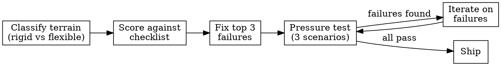

# Plugin Quality Improvement v2

**Skill type: RIGID** — Follow the complete process in order. Do not adapt, skip, or reorder steps.

Announce: "Using sineya's improvement process to [classify/audit/fix/pressure-test] this plugin."

Create a task list with these items before starting:
1. Classify terrain (rigid vs flexible)
2. Score against improvement checklist (all tiers)
3. Fix top 3 failures
4. Pressure test (3 scenarios)
5. Iterate on failures (max 3 rounds)

User instructions take precedence over this skill. Default system prompt behaviors yield to this skill.

<HARD-GATE>
Do not propose or make any fix until you have:
1. Classified the plugin's constraint terrain
2. Scored every Tier 1 item in the improvement checklist
If you find yourself reaching for a fix before completing both steps, stop and go back.
</HARD-GATE>

Make Claude Code plugins that get followed. Distilled from obra/superpowers (101k stars), 48 academic papers (2025–2026), 15+ production plugins, Anthropic's official guidance, and practitioner compliance reports.

**The core insight has not changed:** plugins that encode process outperform plugins that encode knowledge. But v2 adds a sharper formulation from Jesse Vincent's empirical JSON traces: **comprehension and compulsion are not the same thing.** Claude can perfectly understand an instruction while systematically not following it. Every recommendation below addresses this gap.

## Constraint terrain model

Before writing anything, classify your skill's terrain (per Anthropic's official guidance):

- **Narrow mountain path** — one correct approach, high stakes → RIGID skill, imperative language, hard gates, hook enforcement
- **Open field** — many valid paths, low stakes → FLEXIBLE skill, explain the *why*, document deviations

Mismatching terrain to constraint level is the #1 design error. Over-constraining open fields creates friction. Under-constraining narrow paths creates drift.

## When to read each reference file

Read `${CLAUDE_PLUGIN_ROOT}/skills/sineya/references/improvement-checklist.md` when:
- Creating a new plugin or reviewing an existing one
- Debugging poor compliance (Claude ignores or partially follows the skill)
- Designing subagent prompts for orchestrated workflows

Read `${CLAUDE_PLUGIN_ROOT}/skills/sineya/references/anti-patterns.md` when:
- A skill triggers but Claude rationalizes skipping steps
- Subagents drift from specs or rubber-stamp reviews
- You need pressure-test scenarios before release

Read `${CLAUDE_PLUGIN_ROOT}/skills/sineya/references/architecture-plugin-patterns.md` when:
- Building plugins for system design, plan→implement→review pipelines, or multi-phase dev workflows

Read `${CLAUDE_PLUGIN_ROOT}/skills/sineya/references/hook-patterns.md` when:
- Writing hook scripts (SessionStart, PreToolUse, PostToolUse)
- Needing deterministic enforcement that prompts cannot provide
- Debugging silent hook failures

Read `${CLAUDE_PLUGIN_ROOT}/skills/sineya/references/academic-foundations.md` when:
- You want the research citations backing a specific recommendation
- Deciding between competing approaches and need empirical evidence
- Designing evaluation criteria for skill quality

## The improvement process

### Priority of changes (highest impact first)

1. **Fix async SessionStart hooks** — if `"async": true`, your bootstrap silently never loads. Change to `false`.
2. **Add hard gates** for critical steps — `<HARD-GATE>` blocks with explicit stop conditions
3. **Convert suggestions to testable constraints** — "consider writing tests" → "If a production file exists without a test file, delete the production file and write the test first." (d = −7.84 effect size)
4. **Flip negative rules to positive** — "Do NOT use default exports" → "Use named exports exclusively" (~50% violation reduction)
5. **Add anti-rationalization table** — name the exact rationalizations Claude will use (Meincke et al.: 33% → 72% compliance)
6. **Apply primacy/recency placement** — critical rules in first 5 lines AND last 5 lines of SKILL.md
7. **Add decision flowchart** in DOT notation for branching logic
8. **Isolate subagent context** with `context: fork` — reviewers never see session history
9. **Add circuit breakers** for any autonomous/loop workflow
10. **Keep bootstrap under 2k tokens** — you have a budget of ~150 instructions total before compliance decays linearly

## Hard budget constraints

- **~150 effective instructions** before compliance drops (Jaroslawicz et al., 2025). System prompt uses ~50. You get ~100.
- **SKILL.md under 500 lines / 5,000 words** (Anthropic guidance). Frequently-loaded skills: under 200 words.
- **60% context utilization max** — quality degrades past this. Each MCP server permanently consumes context. Cap at 5–8 servers.
- **CLAUDE.md is advisory at ~80% compliance.** Hooks are deterministic at 100%. If it must happen, use a hook.

## Circuit breakers

- MAX_ITERATE: 3 — after 3 rounds of pressure test then iterate, stop and report remaining failures to the user
- SAME_FAILURE: 2 — if the same checklist item fails after 2 fix attempts, escalate to the user

## Rationalization red flags

If you catch yourself thinking any of these, STOP. You are rationalizing non-compliance with the improvement process.

| Your thought | The reality |
|---|---|
| "I can see the problems already, skip the checklist" | The checklist catches what you overlook. Score every Tier 1 item. |
| "This plugin is obviously rigid/flexible" | Obvious classifications still need to be stated and recorded. Classify explicitly. |
| "The fixes are clearly correct, no need to pressure test" | The brainstorming skill was "clearly correct" and failed on a todo app. Test. |
| "I'll just fix this one thing quickly" | Quick fixes without classification and scoring cause drift. Follow the process. |
| "Pressure testing is overkill for this small plugin" | Small plugins are where skipped steps hurt most — less surface to catch errors later. |

Follow the complete process in order. Do not skip to fixes without classifying terrain and scoring against the checklist first.
